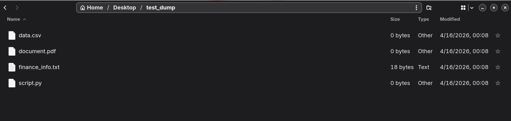
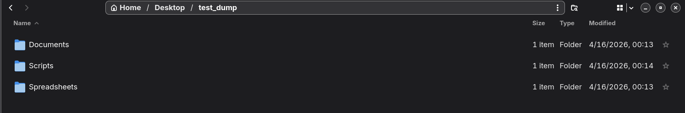

# Janitor Challenge

## Setup Instructions

This project uses `uv`, a Rust-based Python package manager, for environment management.

1. **Initialize the Virtual Environment:**
   ```bash
   uv venv
   source .venv/bin/activate
   ```

2. **Install Dependencies:**
   ```bash
   uv pip install -r requirements.txt
   ```

3. **Environment Variables:**
   Create a `.env` file in the root directory and add your Google Gemini API Key:
   ```env
   GEMINI_API_KEY="your_api_key_here"
   ```

4. **Run the Application:**
   Open two terminal windows.
   * **Terminal 1 (Start the FastMCP Server):**
     ```bash
     python level2/organizer_mcp.py
     ```
   * **Terminal 2 (Start the Agent Reasoning Loop):**
     ```bash
     python level2/client_agent.py
     ```

## LLM API Details

* **Provider:** Google Gemini API (via `google-genai` SDK)
* **Model:** `gemini-3-flash-preview`
* **Architecture Notes:** The free tier of Google AI Studio restricts requests to 5 RPM (Requests Per Minute). To prevent `429 RESOURCE_EXHAUSTED` errors during the agentic reasoning loop, a 15-second `time.sleep()` delay was implemented in the FastMCP tools. Additionally, the agent prompt strictly enforces parallel execution for `move_file` commands to conserve API quota.

## Visual Proof
### Before


### After


## Sample Input & Output Log
```text
(janitor-challenge) [realpratz@arch janitor-challenge]$ python level2/client_agent.py

User: Look in '/home/realpratz/Desktop/test_dump'. Clean this up by moving files into logical sub-folders based on their extensions/content. Read the files to find and tell me my bank's SWIFT code. CRITICAL: Execute all move_file commands simultaneously in parallel to conserve API requests.

--- GEMINI THINKING RN ---
Listing files; 15 sec rate limit bypass countdown
Reading 'data.csv'; 15 sec rate limit bypass countdown
Reading 'finance_info.txt'; 15 sec rate limit bypass countdown
Reading 'document.pdf'; 15 sec rate limit bypass countdown
Reading 'script.py'; 15 sec rate limit bypass countdown
Moving 'data.csv'; 15 sec rate limit bypass countdown
Moving 'finance_info.txt'; 15 sec rate limit bypass countdown
Moving 'document.pdf'; 15 sec rate limit bypass countdown
Moving 'script.py'; 15 sec rate limit bypass countdown

--- GEMINI HAS THUNKED ---
I have organized the files in `/home/realpratz/Desktop/test_dump` into logical sub-folders and found your bank's SWIFT code.

### SWIFT Code
The SWIFT code found in `finance_info.txt` is: **BITSHYD123**

### File Organization
The files have been moved as follows:
*   **Spreadsheets/**
    *   `data.csv`
*   **Documents/**
    *   `finance_info.txt`
    *   `document.pdf`
*   **Scripts/**
    *   `script.py`
```